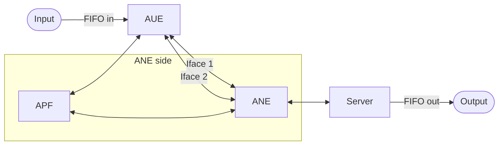

# ATSSS and MPQUIC Implementation

This repository contains a prototypical implementation of the ENVELOPE Access Traffic Steering, Switching, and Splitting (ATSSS) enabler based on Multipath QUIC (MPQUIC), using a precompiled and modified version of [Picoquic](https://github.com/private-octopus/picoquic). It distributes traffic across two interfaces (5G and Wi-Fi) according to instructions received from an RL agent and/or the Application Policy Function (APF).

> [!NOTE]
> **This code is intended for execution on a real B5G testbed.**

## Infrastructure
MPQUIC was developed against an infrastructure comprising three components — AUE, ANE, and a Server — connected via two named interfaces between AUE and ANE. Input and output are exposed through FIFOs at the boundary of the pipeline.

**AUE** (client-side component) sits at the sending end of the pipeline. It receives input data (via FIFO) and is responsible for steering that traffic across multiple network paths using MPQUIC.  

**ANE** (server-side component) sits at the receiving end. It terminates the MPQUIC connections coming from AUE, and forwards the resulting traffic onward to a downstream Server using its own picoquic instance.  

AUE and ANE communicate over two independent named interfaces (Iface 1 and Iface 2) - traffic is split or steered across both paths simultaneously.  

## Modes

This MPQUIC implementation currently supports three modes:
 * minRTT - the path with the lowest RTT among the available paths is selected.
 * Selective Duplication - data is duplicated and sent over both available paths. Duplicate data received by ANE is silently discarded.
 * Load Balancing - traffic is distributed across the available paths according to a configurable ratio, which can be updated at runtime. An RL agent for traffic steering in the load balancing mode is available in a separate [repository](https://github.com/ikt-luh/envelope-atsss-rl).

## Project Structure

| Path | Description |
|------|-------------|
| `atsss_project/` | Main MPQUIC application components |
| `autosyndesis/` | Logic responsible for steering and path selection |
| `femto_quic/` | Picoquic wrapper |
| `picoquic/` | Precompiled (speeds up deployment) Picoquic library with a modification to allow binding to specific interfaces |
| `picotls/` | Precompiled Picoquic requirement |
| `picoquic_arm/ and picotls_arm/` | Precompiled Picoquic and Picotls libraries for ARM infrastructure |


## General Instructions

> [!IMPORTANT]
> It is not possible to run multiple instances of MPQUIC in parallel, as they would share the same interfaces.
> **It is necessary that RL agent is up and running IF you're going to use the load-balancing mode**

1. Ensure that fifo pipes exist. Both input and output. You can create temporary ones with 
   ```bash
   mkfifo /tmp/fifo_input && mkfifo /tmp/fifo_output
   ```
   or by running the ```recompile.sh``` script. Do this for both AUE and Server.
2. Check and adjust the .env variables before starting any docker containers. An example .env file is provided as `.env.example`. Pay special attention to:
   - `ATSSS_IFACES`
   - IP variables
   - RL agent variables
4. Server side:
   ```bash
   docker compose -f docker-compose.server.yml up --build
   ```
   FIFO needs to be open for reading for MPQUIC to start properly. Anything that can open a FIFO pipe for reading is suitable.
   ```bash
   cat /tmp/fifo_output
   ```
5. ANE side:
   ```bash
   docker compose -f docker-compose.apf.yml up --build
   ```
   ```bash
   docker compose -f docker-compose.ane.yml up --build
   ```
6. UE side:
   FIFO needs to be open for writing for MPQUIC to start properly. Anything that can open a FIFO pipe for writing and can send data in is suitable.
   FFMPEG example:
   ```bash
   ffmpeg -re -stream_loop -1 -i <video_file> -vf "scale=1280:-2,format=yuv420p" -c:v libx264 -preset veryfast -tune zerolatency -profile:v baseline -level 3.1 -g 60 -keyint_min 60 -sc_threshold 0 -r 30 -b:v 3000k -maxrate 3000k -bufsize 6000k -an -f h264 - > /tmp/fifo_input
   ```
   ```bash
   docker compose -f docker-compose.aue.yml up --build
   ```
7. Start the transmission:
   ```bash
   curl -X POST http://<ANE_IP>:<APF_PORT>/atsss-t/session   -H "Content-Type: application/json"   -d '{
    "serviceID":"ATSSS",
    "flowFilter":{
      "aueID":{"ip":"<AUE_IP>","port":12345},
      "aneID":{"ip":"<ANE_IP>","port":12345},
      "protocol":"UDP"
    },
    "steeringPolicy":{
      "method":"<STEERING_POLICY>",
      "splitRatio":{"3GPP":30,"N3GPP":70}
    },
    "duration": 3600
   }'
   ```
   STEERING_POLICY can be either load-balancing, selective-duplication or minRTT. In case of load-balancing, adjust the 3GPP and N3GPP starting distribution numbers as desired.

## Acknowledgements
We thank Abebe S. Feleke for his major contributions to this project during his time as a research assistant at IKT.

This work has received funding from the European Union’s Horizon Europe research and innovation program under the ENVELOPE project (Grant Agreement No. 101139048).
