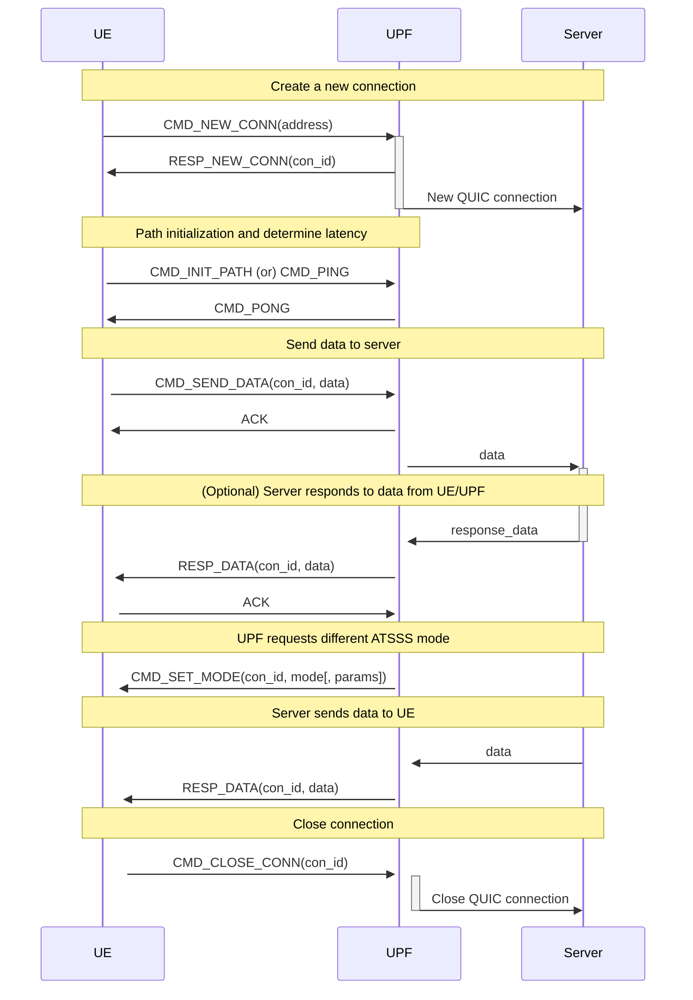

# Smart-Multipath-Project: ATSSS-like data transfer over MP-QUIC

Project that implements multipathing using Femto-QUIC (based on PicoQUIC) and AuToSyndeSiS to make path decisions. A protocol is implemented to handle the communication between all hosts. The concept is inspired on ATSSS.

This project does not use the IETF-draft MP-QUIC but rather a custom implementation using two PicoQUIC instances. This is implemented in `femtp_mp.h`.


- ATSSS Server
  - Only speaks "normal" QUIC
- ATSSS UPF
  - Bridge between UE and Server
  - Translates ATSSS multipathing into "normal" QUIC
  - Controls the ATSSS mode of the UE
- ATSSS UE
  - Client that connects to the server via the UPF
  - Speaks ATSSS multipathing QUIC


## Building

```bash
mkdir build && cd build

export FEMTO_QUIC_DIR=...
export AUTOSYNDESIS_DIR=...
export PICOQUIC_DIR=...
export PICOTLS_DIR=...

cmake ..
make
```

## Usage

To use the demo system, you first need to start the application server, then start the UPF translation software, and finally start the UE client.

### Start the Server

```bash
./atsss_server 4445 ./cert.pem ./key.pem
```

### Start the UPF

```bash
./atsss_upf 4443,4444 ./cert.pem ./key.pem
# optionally, an initial AuToSyndeSiS mode can be specified:
./atsss_upf 4443,4444 ./cert.pem ./key.pem <initial mode> <mode parameters> <gobackn enabled>
```

### Start the UE

```bash
./atsss_ue 10.0.1.2:4443,10.0.2.2:4444 10.0.5.1:4445
# optionally, an initial AuToSyndeSiS mode can be specified:
./atsss_ue 10.0.1.2:4443,10.0.2.2:4444 10.0.5.1:4445 <initial mode> <mode parameters> <num iterations> <gobackn enabled> <sending interval us>
# initial mode: 0=Active-Standby  1=MinRTT  2=RoundRobin  3=Opportunistic-Redundant
# mode parameters: default path | minrtt margin | share (e.g., "2,1") | minrtt margin
# gobackn enable: 0=off  1=Go-Back-N  2=Selective-Repeat (tbd)
# sending interval: 0=max or time between sending packets in microseconds
```

The sending interval is calculated from the packet size defined in `eval_perf_pkg_t` and the target sending rate: `sending_interval_us = int((PKG_SIZE_BYTES * 8) / (TARGET_RATE_MBPS * 1e6) * 1e6)`

### Change the path selection strategy (mode)

```bash
# Active-Standby with the default path 0
./trigger_upf_mode 0 0

# Smallest Delay / MinRTT with 2000µs switch margin
./trigger_upf_mode 1 2000

# Round Robin with 2 paths and a 1:2 share
./trigger_upf_mode 2 2 1,2

# Duplication / Opportunistic Redundant with 2000µs switch margin
./trigger_upf_mode 3 2000
```


## Flow

1. *UE* request connection to *Server* at `ip:port` from *UPF*
2. *UPF* connects to *Server* at `ip:port` using "normal"/single-path QUIC and sends new Connection ID to *UE*
3. *UE* sends data to *UPF* via multipath with ATSSS header, *UPF* forwards payload via normal QUIC to the *Server*
4. *Server* responds data to *UPF* which puts it in an ATSSS packet and sends it over multipath to the *UE*
5. *UE* receives the ATSSS data packet, extracts the payload and forwards it to the client application
6. *UE* sends close request to *UPF*, the *UPF* then closes the QUIC connection to the *Server*




The protocols commands are defined and described in `atsss_project.h`. They are sent from various part in the code and handled in the FemtoQUIC callback functions.
