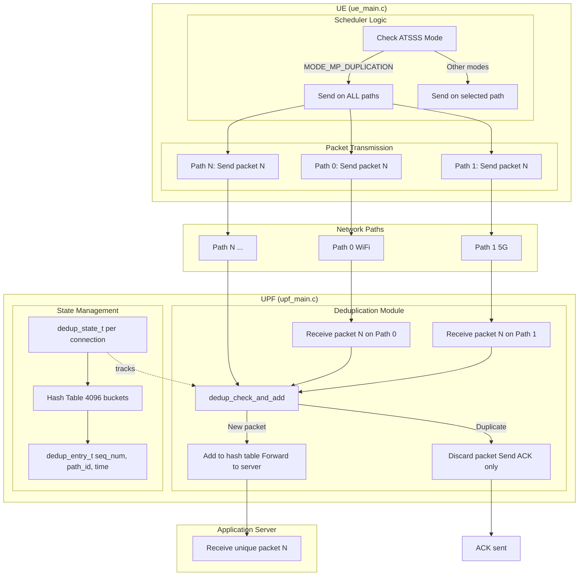

# Duplication Policy

## Overview

This doc describes the implementation of the **Duplication Policy**  for MP-QUIC / ATSSS. This policy provides redundancy by sending each packet over all available paths simultaneously, with duplicate detection and discarding at the UPF (User Plane Function).


The following behavior has been validated:

- When duplication mode is selected, the scheduler places each packet on all available paths.
- UPF maintains state to track which packet numbers have arrived.
- UPF detects duplicate packets and discards them, forwarding only the first copy to the server.
- Server receives exactly one copy of each packet, ensuring no duplicate processing.

### What implemented?

We implemented **Multipath Duplication** with UPF-side deduplication:
- **Scheduler (UE)**: When duplication mode is active, sends each packet on all available paths simultaneously
- **Deduplication (UPF)**: Maintains a hash table-based state to track received packet sequence numbers
- **First-copy forwarding**: UPF forwards only the first copy of each packet to the server
- **Duplicate discarding**: Subsequent copies of the same packet are detected and discarded
- **ACK handling**: UPF still sends ACKs for all received packets (including duplicates) to maintain protocol correctness

## Arch

Important implementation note:

- This project uses a **multi-connection multipath** design (each "path" is an independent QUIC connection) and then steers application traffic at ATSSS layer across those connections.
- Duplication happens at the **ATSSS layer**, not at the QUIC layer, meaning each path maintains its own QUIC connection state.



## Implementation Details

### Files Modified/Added

| File | Changes |
|------|---------|
| `autosyndesis/autosyndesis.h` | Defines `MODE_MP_DUPLICATION` enum value |
| `atsss_project/atsss_project.h` | Defines `ATSSS_MODE_MP_DUP` protocol constant |
| `atsss_project/ue_main.c` | Added duplication logic: sends packets on all paths when mode is `MODE_MP_DUPLICATION` |
| `atsss_project/upf_main.c` | Integrated deduplication module: checks duplicates before forwarding, maintains per-connection state |
| `atsss_project/deduplication.h` | **NEW** - Header for deduplication module (hash table structure, function prototypes) |
| `atsss_project/deduplication.c` | **NEW** - Implementation of hash table-based deduplication with sequence number tracking |
| `atsss_project/CMakeLists.txt` | Added `deduplication.c` to UPF build |
| `test_duplication.sh` | **NEW** - End-to-end test script for duplication policy validation |


### Deduplication Algorithm (deduplication.c)

The deduplication module uses a **hash table with chaining**:

1. **Hash Function**: `hash = seq_num % DEDUP_HASH_TABLE_SIZE` (4096 buckets)
2. **Lookup**: Traverse the chain in the hash bucket to find matching `seq_num`
3. **Insert**: If not found, create new entry and add to chain
4. **Duplicate Detection**: If `seq_num` already exists in hash table, return `true`

**Time Complexity**: 
- Average case: O(1) for lookup/insert
- Worst case: O(n) where n is number of entries in a bucket (rare with good hash distribution)

**Space Complexity**: 
- O(k) where k is the number of unique packets seen
- Each entry stores: seq_num (4 bytes), timestamps (8 bytes), path_id (1 byte), pointer (8 bytes) ≈ 21 bytes per unique packet


## Testing

### Local Test (Network Namespaces)

```bash
cd envelope-multi-connectivity
sudo ./test_duplication.sh run
```

What it does:

- Creates network namespaces + veth pairs to emulate two physical paths (WiFi and 5G)
- Starts `atsss_server`, `atsss_upf`, and `atsss_ue` with duplication mode enabled
- Sends 100 packets from UE
- Validates:
  - UE sends each packet on all available paths (200 total packets sent)
  - UPF detects exactly 100 duplicate packets
  - UPF forwards exactly 100 unique packets to server
  - Server receives exactly 100 unique packets (no duplicates)

### Test Output Analysis

The test script analyzes logs and reports:

```
=== Duplication Policy Test Results ===
Packets sent on all paths (duplication): 100
Duplicate packets detected: 100
Data packets forwarded to server: 100
Packets received by server: 100

SUCCESS: Duplicates detected and discarded
SUCCESS: Server received <= UE duplicated packets (deduplication working)
```

### Manual Testing

To test duplication policy manually:

```bash
# Terminal 1: Start server
cd atsss_project/build
sudo ip netns exec ns_upf ./atsss_server 8080

# Terminal 2: Start UPF with duplication mode (mode 3)
sudo ip netns exec ns_upf ./atsss_upf "4443,4444" \
    cert.pem key.pem 3 1000000 0

# Terminal 3: Start UE with duplication mode (mode 3)
sudo ./atsss_ue "10.0.1.2:4443/12,10.0.2.2:4444/14" \
    "10.0.3.1:8080" 3 1000000 100 0 100000
```

Expected behavior:
- UE logs show: `Sent message over all paths (duplication mode): <X> (paths: 0 1)`
- UPF logs show: `Duplicate packet detected (con_id=0, seq_num=X, path_id=Y) - discarding`
- Server receives exactly one copy of each packet

---

## Configuration

### Enabling Duplication Mode

Duplication mode is enabled by setting ATSSS mode to `3` (MODE_MP_DUPLICATION):

**UE Command Line:**
```bash
./atsss_ue "server1:port1/if1,server2:port2/if2" "app_server:port" \
    3 <margin_us> <num_packets> <gobackn> <interval_us>
```

Where:
- `3` = Duplication mode
- `margin_us` = Switch margin in microseconds (used for MinRTT properties, typically 1000000)
- Other parameters: same as other modes

**UPF Command Line:**
```bash
./atsss_upf "port1,port2" cert.pem key.pem \
    3 <margin_us> <gobackn>
```

Where:
- `3` = Duplication mode
- `margin_us` = Switch margin in microseconds
- `gobackn` = ARQ mode (0=none, 1=Go-Back-N, 2=Selective Repeat)

### Protocol Message Format

The ATSSS protocol uses `ATSSS_MODE_MP_DUP` (0x03) to indicate duplication mode:

```c
// ATSSS SET_MODE command
uint8_t packet[] = {
    ATSSS_PACKET_MAGIC,      // 0xAA
    ATSSS_CMD_SET_MODE,      // 0x02
    con_id,                   // Connection ID
    ATSSS_MODE_MP_DUP,        // 0x03 = Duplication mode
    margin_bytes[0],          // Margin (4 bytes, big-endian)
    margin_bytes[1],
    margin_bytes[2],
    margin_bytes[3]
};
```

### Deduplication Configuration

The deduplication module has configurable parameters in `deduplication.h`:

```c
#define DEDUP_HASH_TABLE_SIZE 4096      // Hash table size (must be power of 2)
#define DEDUP_MAX_SEQ_PER_BUCKET 16     // Max entries per bucket (informational)
```

**Tuning Guidelines:**
- **Hash Table Size**: Larger tables reduce collisions but use more memory
  - 4096 buckets: Good for connections with < 100K unique packets
  - 8192 buckets: Better for high-throughput long-running connections
- **Memory Usage**: Each unique packet uses ~21 bytes (entry + overhead)
  - 100K packets ≈ 2.1 MB per connection
  - 1M packets ≈ 21 MB per connection

---

## Technical Details

### Hash Table Design

The deduplication module uses a **chained hash table**:

- **Hash Function**: Simple modulo hash (`seq_num % 4096`)
- **Collision Handling**: Linked list chaining within each bucket
- **Load Factor**: Average entries per bucket = total_entries / 4096
- **Performance**: O(1) average case, O(n) worst case per bucket

**Why Hash Table?**
- Fast lookup: O(1) average case vs O(log n) for sorted list
- Memory efficient: Only stores seen sequence numbers, not gaps
- Scalable: Handles out-of-order packets efficiently

### Sequence Number Tracking

The deduplication state tracks:
- **seq_num**: Packet sequence number (32-bit, 0 to 4,294,967,295)
- **first_arrival_time**: Timestamp when first copy arrived (for statistics/debugging)
- **first_path_id**: Path ID where first copy arrived (for statistics/debugging)

**Wraparound Handling:**
- Detects when sequence number wraps from UINT32_MAX to 0
- Uses heuristic: if `highest_seq_seen > UINT32_MAX - 1000000` and `seq_num < 1000000`, likely wraparound
- Sets `wraparound_detected` flag to handle subsequent small sequence numbers correctly

### ACK Behavior

**Important**: UPF sends ACKs for **all received packets**, including duplicates:

- **Why?** Maintains protocol correctness and prevents UE retransmissions
- **UE Behavior**: UE may receive multiple ACKs for the same packet (one per path)
- **UE Handling**: UE processes ACKs normally, no special deduplication needed for ACKs

### Integration with ARQ (Automatic Repeat Request)

The deduplication module works alongside ARQ protocols:

- **Go-Back-N (gobackn=1)**: Deduplication happens before ARQ processing
- **Selective Repeat (gobackn=2)**: Deduplication happens before ARQ processing
- **No ARQ (gobackn=0)**: Deduplication is the only reliability mechanism

**Processing Order:**
1. Receive packet
2. **Deduplication check** (discard if duplicate)
3. If new packet: ARQ processing (if enabled)
4. Forward to server (if not duplicate)

### Memory Management

**Per-Connection State:**
- Initialized in `atsss_new_conn()` via `dedup_init()`
- Cleaned up in `atsss_close_conn()` via `dedup_cleanup()`
- Memory is freed when connection closes

**Memory Leak Prevention:**
- `dedup_cleanup()` frees all hash table entries
- Called automatically when connection closes
- No manual memory management required by application code

---

**When to Use Duplication Mode:**
- Critical applications that cannot tolerate packet loss
- Unreliable network conditions (e.g., mobile handover)
- Real-time applications where retransmission latency is unacceptable
- Willing to trade bandwidth for reliability

**When NOT to Use Duplication Mode:**
- Bandwidth-constrained environments
- Cost-sensitive applications (2× bandwidth usage)
- Very reliable networks where redundancy is unnecessary

---

## Future Enhancements

### Adaptive Duplication

- Duplicate only critical packets (e.g., based on packet type or priority)
- Reduce bandwidth overhead while maintaining reliability for important traffic

### Time-Based Cleanup

- Automatically remove old entries from hash table after timeout
- Prevent memory growth in long-running connections

### Enhanced Statistics

- Track duplicate detection rate
- Measure time difference between first and duplicate arrivals
- Monitor hash table load factor and collision rate

### Selective Duplication

- Duplicate only on paths with high loss rate
- Use single-path mode on reliable paths, duplication on unreliable paths

## References

- **ATSSS Specification**: 3GPP TS 24.193 (Access Traffic Steering, Switching and Splitting)
- **QUIC Multipath**: RFC 9000 (QUIC: A UDP-Based Multiplexed and Secure Transport)
- **Hash Table Design**: "Introduction to Algorithms" by Cormen, Leiserson, Rivest, and Stein (Chapter 11)