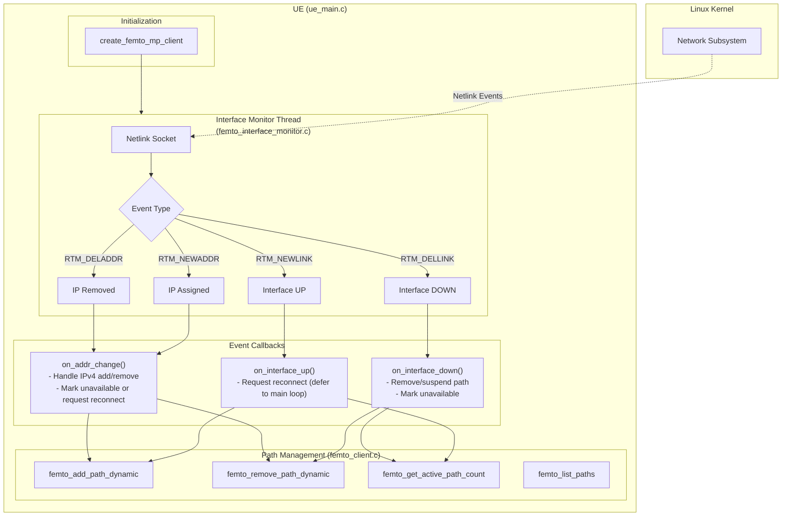

# Dynamic Interface Management for MP-QUIC

## Overview

This document describes the implementation of dynamic interface management for MP-QUIC / ATSSS, enabling automatic detection and handling of network interface changes at runtime.

### Status (end-to-end)

The following end-to-end behavior has been validated:

- When a path/interface goes down, traffic is steered to the remaining path.
- When the interface returns and gets IPv4, the path is re-enabled after ATSSS PING/PONG confirmation and traffic can use it again.
- Periodic PING/PONG on a non-active path is expected (liveness and RTT measurement).

### Problem

The original MP-QUIC implementation had **static interface binding**:
- Interfaces were set only at initialization
- No ability to add/remove paths during runtime
- If WiFi went down, the path stayed bound to a dead interface
- If a better interface (e.g., 5G) became available, it couldn't be used
- **Provider handover not supported**: If 5G provider changed (same interface, new IP), path would break

### Solution

We implemented **Runtime Path Probing** with automatic interface monitoring:
- Netlink sockets (Linux) detect interface state changes in real-time
- **IP address change detection** for provider/AP handover scenarios and link flaps
- Callbacks react to interface/IP events and update per-path availability
- Re-enable completion is confirmed via ATSSS PING/PONG
- The UE steers traffic using an availability mask (do not assume path 0 is always the remaining path)

---

## Architecture

Important implementation note:

- This project uses a **multi-connection multipath** design (each "path" is an independent QUIC connection) and then steers application traffic at ATSSS layer across those connections.



---

## Implementation Details

### Files Modified/Added

| File | Changes |
|------|---------|
| `femto_quic/femto_types.h` | Added `dynamic_path_info_t` structure and new fields to `femto_client_ctx_t` |
| `femto_quic/femto_client.c` | Client setup hardening and multipath behavior fixes |
| `femto_quic/femto_interface_monitor.c` | **NEW** - Netlink-based interface monitoring (link and addr events, including IPv4 removal notifications) |
| `femto_quic/femto_interface_monitor.h` | **NEW** - Header for interface monitor |
| `femto_quic/femto.h` | Added public API declarations |
| `atsss_project/ue_main.c` | Dynamic interface callbacks, safe reconnect flow, steering fixes, PING/PONG re-enable |
| `atsss_project/upf_main.c` | Improved UPF dynamic-path status handling and probing logs |
| `atsss_project/curl_functions.c` | Added HTTP timeouts to avoid blocking UE/UPF main loop when endpoints are unreachable |
| `test_local.sh` | **NEW** - Local `netns` + `veth` end-to-end test for dynamic interface (link flap, re-enable validation) |
| `.gitignore` | Ignore common build artifacts and local runtime logs (`ue_log.txt`, `upf_log.txt`, etc.) |
| `docs/dynamic_interface.md` | Documentation of architecture, testing, known issues, and bugs fixed |

### Key Structures

```c
// Dynamic path tracking (femto_types.h)
typedef struct st_dynamic_path_info_t {
    int if_index;                      // Interface index
    struct sockaddr_storage server_ip; // Server IP for this path
    int server_port;                   // Server port
    uint64_t unique_path_id;           // PicoQUIC path ID
    int is_active;                     // 1 if active, 0 if removed
    time_t added_time;                 // When path was added
} dynamic_path_info_t;
```

### API Functions

```c
// Add a new path dynamically
int femto_add_path_dynamic(femto_client_t *client, int if_index, 
                           const char *server_ip, int server_port);

// Remove a path dynamically
int femto_remove_path_dynamic(femto_client_t *client, int if_index);

// Get current active path count
int femto_get_active_path_count(femto_client_t *client);

// List all path interface indices
int femto_list_paths(femto_client_t *client, int *if_indices, int max_paths);
```

### Automatic Callbacks (ue_main.c)

Current behavior (high level):

- Interface monitor runs in its own thread.
- Callbacks do not perform unsafe teardown while packets are in-flight; they set flags/state.
- The main loop performs per-path reconnect when needed.

```c
// Called when interface comes UP
void on_interface_up_callback(void *ctx, int if_index) {
    // Request reconnect for the owning path; main loop performs it safely
    g_reconnect_requested[path_id] = 1;
}

// Called when interface goes DOWN
void on_interface_down_callback(void *ctx, int if_index) {
    // Remove/suspend and mark unavailable immediately
    femto_remove_path_dynamic(&client, if_index);
    g_path_available[path_id] = 0;
}

// Called when IP address changes (provider/AP handover) or IPv4 is removed/added
void on_addr_change_callback(void *ctx, femto_addr_change_info_t *change_info) {
    // IPv4 removed: mark unavailable immediately to steer traffic away
    // IPv4 assigned/changed: request reconnect for that path
}
```

---

## Flow Examples

### Scenario 1: Mobile User Moving from Home to Car

```
Time T0: User at home
├── WiFi (wlan0, index=2): UP, connected
├── 5G (wwan0, index=3): DOWN, not connected
└── Active paths: 1 (WiFi only)

Time T1: User enters car, 5G becomes available
├── [NETLINK] Detected interface 3 UP
├── [CALLBACK] on_interface_up(3)
├── [ACTION] femto_add_path_dynamic(3, "10.0.2.2", 4444)
├── [ACTION] update_scheduler_paths(2)
└── Active paths: 2 (WiFi + 5G)

Time T2: User leaves home WiFi range
├── [NETLINK] Detected interface 2 DOWN
├── [CALLBACK] on_interface_down(2)
├── [ACTION] femto_remove_path_dynamic(2)
├── [ACTION] update_scheduler_paths(1)
└── Active paths: 1 (5G only)

Time T3: User arrives at destination with WiFi
├── [NETLINK] Detected interface 2 UP
├── [CALLBACK] on_interface_up(2)
├── [ACTION] femto_add_path_dynamic(2, "10.0.1.2", 4443)
├── [ACTION] update_scheduler_paths(2)
└── Active paths: 2 (WiFi + 5G)
```

### Scenario 2: 5G Provider Handover (X -> Y)

```
Time T0: User connected to Provider X
├── 5G (wwan0, index=3): UP, IP=10.0.0.100
└── Active paths: 2 (WiFi + 5G via Provider X)

Time T1: User moves, Provider X signal lost, Provider Y takes over
├── [NETLINK] Detected RTM_NEWADDR on interface 3
├── Interface stays UP, but IP changes: 10.0.0.100 -> 10.0.0.200
├── [CALLBACK] on_addr_change(3, old=10.0.0.100, new=10.0.0.200)
├── [ACTION] femto_remove_path_dynamic(3)  // Remove old path
├── [ACTION] femto_add_path_dynamic(3, ...)  // Add new path with new IP
└── Active paths: 2 (WiFi + 5G via Provider Y)

Note: Path count stays the same, but the path is migrated to new IP
```

### Scenario 3: WiFi AP Handover

```
Time T0: User connected to Home WiFi
├── WiFi (wlan0, index=2): UP, IP=192.168.1.100
└── Active paths: 2

Time T1: User moves to Office WiFi (same interface, different AP)
├── [NETLINK] Detected RTM_NEWADDR on interface 2
├── Interface stays UP, but IP changes: 192.168.1.100 -> 10.10.10.50
├── [CALLBACK] on_addr_change(2, old=192.168.1.100, new=10.10.10.50)
├── [ACTION] femto_remove_path_dynamic(2)
├── [ACTION] femto_add_path_dynamic(2, ...)
└── Active paths: 2 (paths migrated to new IP)
```

### Scenario 4: Link flap (IPv4 removed then re-added)

This is the common "toggle interface" scenario where the interface remains present but loses IPv4 temporarily.

Expected sequence:

1. UE detects IPv4 removal (`RTM_DELADDR`) and marks the path unavailable immediately.
2. Traffic is steered to the other available path.
3. UPF marks the path down and probes it with PING.
4. When IPv4 returns (`RTM_NEWADDR` / `IP CHANGED`), UE requests a reconnect (main loop).
5. UE receives PONG on the recovered path and marks it available again.
6. Traffic can return to the preferred path (depending on scheduler mode).

---

## Testing

### Local test (no testbed required)

```bash
cd envelope-multi-connectivity
sudo ./test_local.sh
```

What it does:

- Creates network namespaces + veth pairs to emulate two physical accesses.
- Runs `atsss_server`, `atsss_upf`, and `atsss_ue`.
- Flaps one veth interface and validates:
  - traffic steers to the other path during outage
  - path is re-enabled after it returns

### Testbed notes

- Some packet loss during the transition can be acceptable.
- The key acceptance is fast failover to the remaining path and successful re-enable after the interface returns.

---

## Configuration

### Server for Dynamic Paths

The server IP and port for dynamic paths are **automatically parsed from the command-line arguments**.

When you run the UE:
```bash
./atsss_ue "10.0.1.2:4443/IFINDEX0,10.0.2.2:4444/IFINDEX1" "10.0.3.1:4445" ...
```

The first server in the list (`10.0.1.2:4443`) is used as the default for dynamic path addition.

In `ue_main.c`, this is parsed at startup:
```c
// Parse server IP and port from argv[1] for dynamic path addition
char *first_server = strtok(server_list_copy, ",");
if (first_server != NULL) {
    char *colon = strchr(first_server, ':');
    if (colon != NULL) {
        *colon = '\0';
        strncpy(g_server_ip, first_server, sizeof(g_server_ip) - 1);
        g_server_port = atoi(colon + 1);
    }
}
```

### Useful environment variables (UE)

These are useful for local testing and to reduce external dependencies:

- `ATSSS_DISABLE_APF=1`: disable APF HTTP calls
- `ATSSS_DISABLE_RTT_POST=1`: disable RTT POST calls
- `ATSSS_PING_INTERVAL_US`: ping interval
- `ATSSS_PING_TIMEOUT_US`: ping timeout
- `ATSSS_PING_MISS_THRESHOLD`: missed PONG threshold before marking a path down

---

## Technical details (implementation notes)

### Liveness and re-enable (ATSSS PING/PONG)

- UE sends periodic PINGs on all physical paths (even when one is temporarily unavailable) to confirm liveness and measure RTT.
- A path is considered re-enabled when UE receives a PONG for that path and marks it available again.
- The PING header must be valid on every send:
  - `ATSSS_PACKET_MAGIC`
  - `ATSSS_CMD_PING`
  - `con_id` (connection ID)

### Fast failover steering

- On IPv4 removal (`RTM_DELADDR`), UE marks the path unavailable immediately (no need to wait for ping-timeout).
- Steering is based on `g_path_available[]` plus `choose_available_path()`.
- Do not assume "remaining path is always path 0": path selection uses `mp_client->num_paths` and the availability mask.

### Debounced down detection

- Paths are not marked down on the first missed PONG. A configurable threshold is used:
  - `ATSSS_PING_MISS_THRESHOLD`
  - `ATSSS_PING_TIMEOUT_US`

### Safe reconnect (multi-connection multipath)

- Reconnect is requested from netlink callbacks but performed in the main loop to avoid races with packet sending.
- Current implementation recreates the per-path client and overwrites the slot to avoid crashes during teardown.

---

## Bugs found during bring-up (and how we fixed them)

### UE never re-enabled a path after flap (no PONG on that path)

- Root cause: UE was sending PING with an incomplete/invalid ATSSS header (missing `con_id`), so UPF dropped PING as invalid and never replied.
- Fix: always populate the ATSSS PING header fields for every PING send.

### Crash during reconnect when tearing down a client

- Root cause: tearing down the femto client while picoquic network threads were active could race and crash.
- Fix: avoid teardown in the callback path; use a safer recreate-and-swap approach in the main loop (workaround).

### UE continued to send data on a down path during IPv4 loss window

- Root cause: interface monitor logged `ADDR_DEL` but did not notify UE logic; UE only reacted after ping-timeout.
- Fix: invoke `on_addr_change` callback on `RTM_DELADDR` and mark the owning path unavailable immediately.

### Large missing ranges when path 0 went down (incorrect steering)

- Root cause: shrinking the scheduler path count to 1 made autosyndesis return only path 0, even when path 0 was unavailable.
- Fix: keep scheduler path count stable and steer using availability mask + path selection over all physical paths.

### Slow or blocking external HTTP calls (APF/RTT post)

- Fix: add curl timeouts and runtime flags to disable those calls for local testing.

## Known issues and limitations

### Some packet loss during a flap is expected

If packets are sent exactly during the outage window, loss can occur. The key goal is:

- steer new traffic to remaining available paths quickly
- re-enable the recovered path once it is confirmed via PING/PONG

### PING/PONG continues on all paths

You may observe continued PING/PONG activity on a path even when most traffic is on another path. This is expected:

- the system probes all physical paths for liveness/RTT
- this makes re-enable faster after a flap

### IPv6 link-local churn

Interfaces may temporarily have only IPv6 link-local addresses during reconfiguration. The implementation ignores IPv6 link-local
for path activation and waits for IPv4 for steering/reconnect decisions.

### Reconnect implementation uses a workaround

The current reconnect flow recreates and swaps a per-path client to avoid teardown races.
This is robust for bring-up/testing, but it is not a perfect long-running resource management solution.
